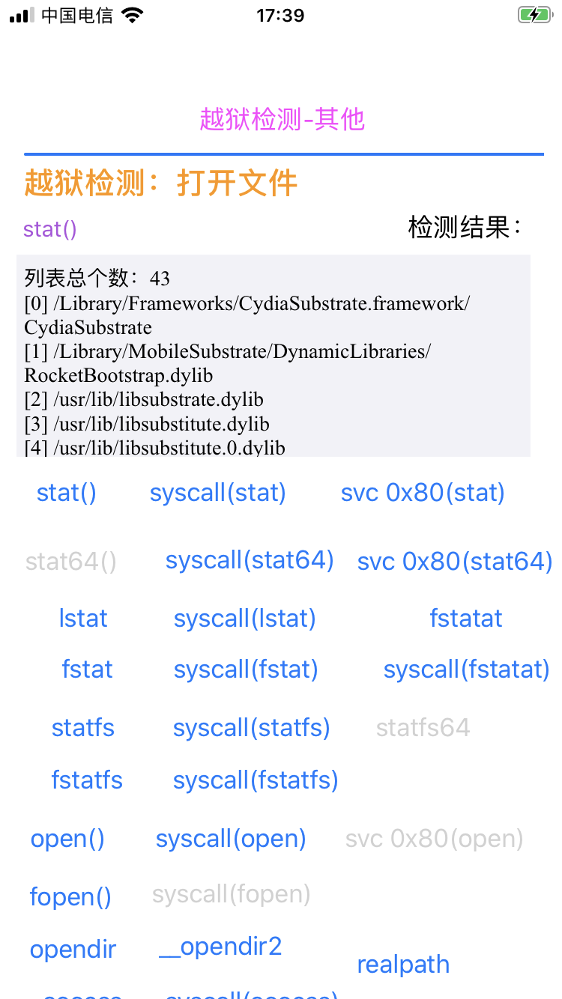
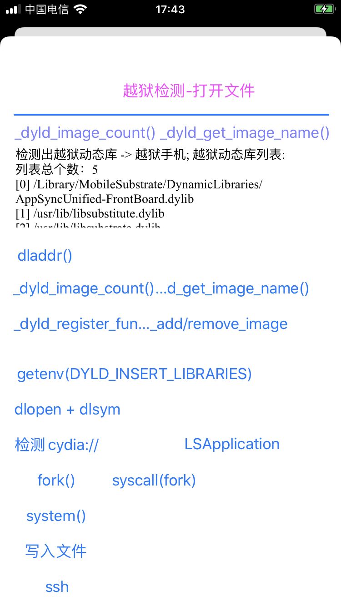
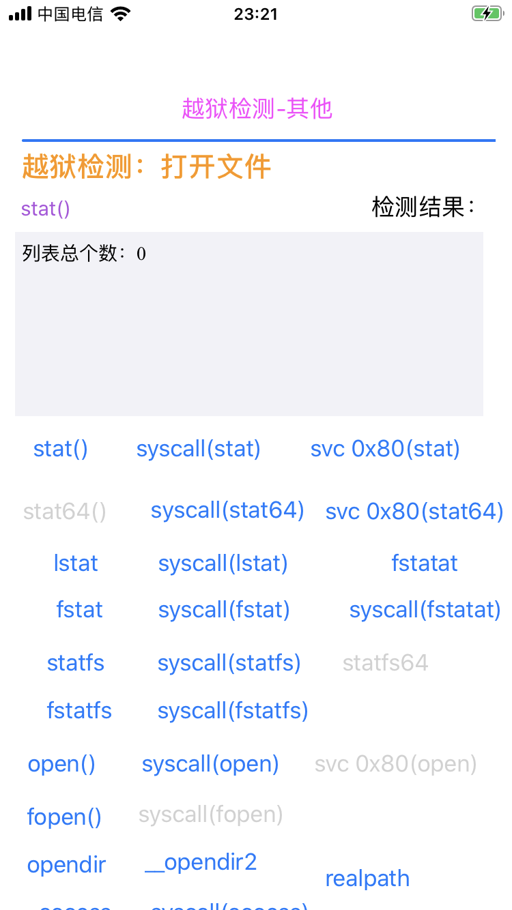
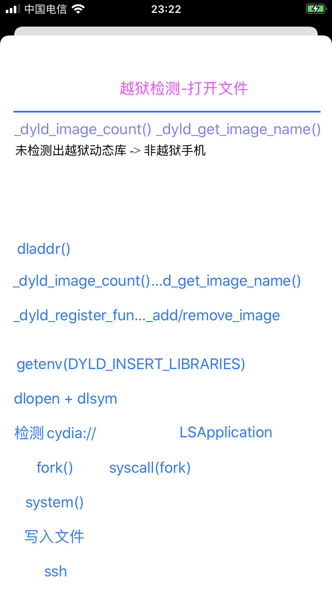

# iOSBypassJailbreak = iOS反越狱检测

最后更新：`20221104`

## 声明

此项目代码仅做技术学习分享之用，**请勿用于其他非法用途**。如有任何非法用途，均与本人无关。

## 项目源码

https://github.com/crifan/iOSBypassJailbreak

```bash
git clone https://github.com/crifan/iOSBypassJailbreak.git
```

## 项目功能

`iOSBypassJailbreak`是一个用[iOSOpenDev](https://github.com/kokoabim/iOSOpenDev)+`Xcode`开发的iOS越狱插件的项目源码，用于实现`反越狱检测`。

## 如何编译出越狱插件tweak

* 初始化配置
  * 确保`Mac`中`Xcode`中的`iOSOpenDev`正常
  * 下载代码：`git clone https://github.com/crifan/iOSBypassJailbreak.git`
  * 用`Xcode`打开`iOSBypassJailbreak.xcodeproj`
  * 更新配置：`Targets`->`iOSBypassJailbreak`->`Build Settings`->`User-Defined`，把`iOSOpenDevDevice`的值`192.168.1.27`改为你的`iPhone`的`IP`地址
  * 确保`Mac`中可以正常`ssh`免密登录你的的越狱`iPhone`
    * -> 用于确保编译后自动通过ssh安装插件到`iPhone`中
* 每次改动后编译
  * `Xcode`->`Build For`->`Profiling`
    * 会自动编译出插件`com.crifan.iOSBypassJailbreak_1.0-1_iphoneos-arm.deb`，自动通过`ssh`安装到`iPhone`中，自动`重启桌面`(`respring`)
    * 可以去`iPhone`中`Cydia`中看到对应新安装的插件

## 如何使用编译后的越狱插件tweak

* 把你要反越狱的app的包名加到：`Package/Library/MobileSubstrate/DynamicLibraries/iOSBypassJailbreak.plist`中
  * `Root`->`Filter`->`Bundles`，新增一个`item`，填入`包名`
* 重新编译`Xcode`->`Build For`->`Profiling`，会自动把生成的插件安装到iPhone中
* [可选]更新插件配置，比如更新版本号：改动文件 `Package/DEBIAN/control`中的值
  * 比如把版本号改为从`1.0-1`改为`1.0-2`
* [可选]去Cydia中确认你的插件是刚安装的新版
* 打开被测试的app，测试反越狱是否生效

### 反越狱效果测试

用之前的越狱测试app：[iOSJailbreakDetection](https://github.com/crifan/iOSJailbreakDetection)，测试出的效果：

* 此反越狱插件没开启 = 反越狱之前
  * `stat`: `43`
    * 
  * `_dyld_image_count() + _dyld_get_image_name()`: `5`
    * 
* 此反越狱插件开启后 = 反越狱之后
  * `stat`: `0`
    * 
  * `_dyld_image_count() + _dyld_get_image_name()`: `0`
    * 

更多测试效果，详见：[iOSJailbreakDetection](https://github.com/crifan/iOSJailbreakDetection)
